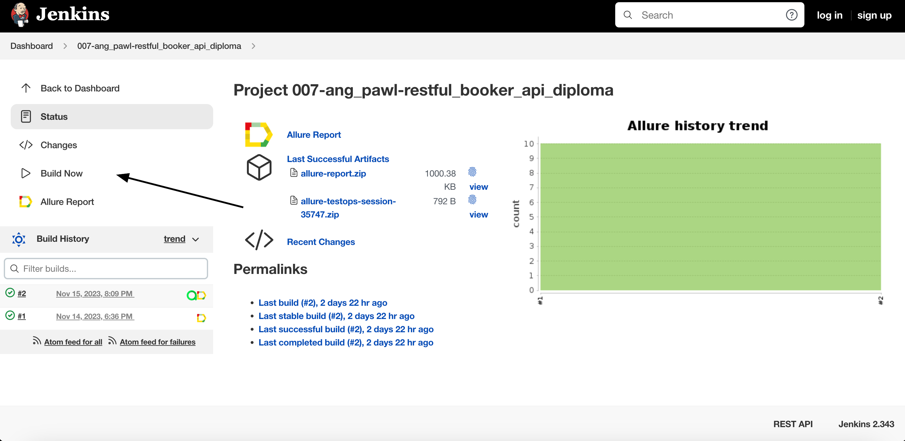
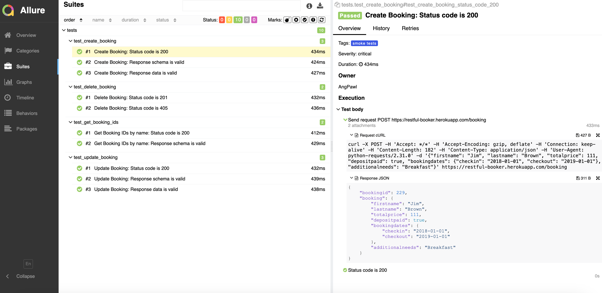
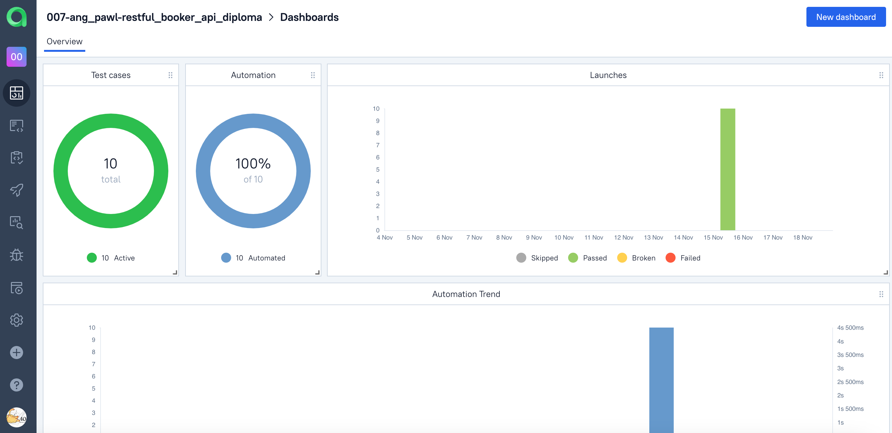
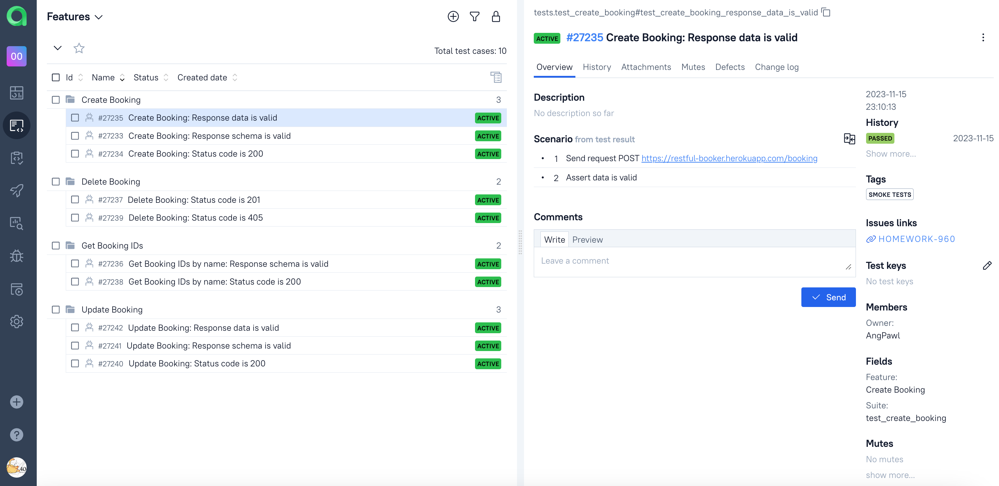
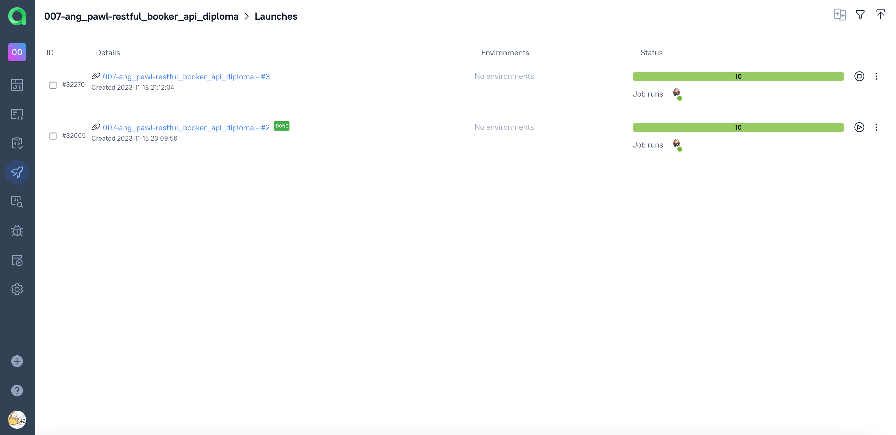
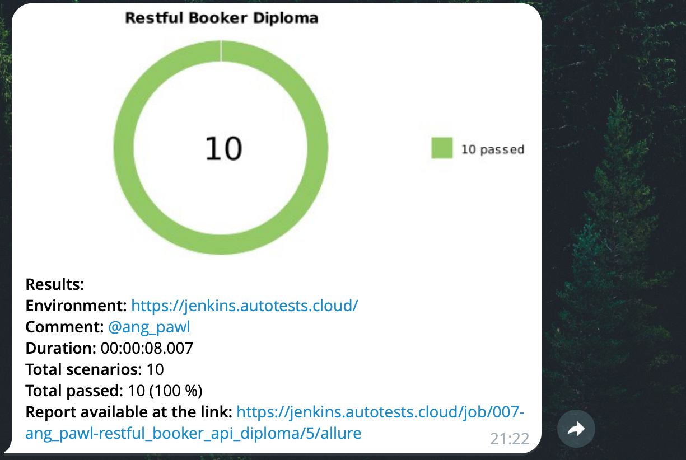

# Demo Project of API tests for <a target="_blank" href="https://restful-booker.herokuapp.com/">Restful Booker</a> service

### Tech Stack:
<code></code>
<code></code>
<code></code>
<code></code>
<code></code>
<code></code>
<code></code>
<code></code>

### Test cases:
- Create Booking:
  - Status code is 200
  - Response schema is valid
  - Response data is valid
- Delete Booking:
  - Status code is 201
  - Status code is 405
  - User cannot log in with invalid password
- Get Booking IDs:
  - Status code is 200)
  - Response schema is valid
- Update Booking:
  - Status code is 200
  - Response schema is valid
  - Response data is valid

### For local launch:

1. Create a new directory on your local machine

```bash
mkdir restful_booker_api_diploma
cd restful_booker_api_diploma
```

2. Clone the repository

```bash
git clone https://github.com/AngPawl/restful_booker_api_diploma
```

3. Create and fill in `.env` file based on env.example in the root project directory

4. Install and activate virtual environment

```bash
python -m venv .venv
```
  - For Linux/macOs:
  ```bash
  source .venv/bin/activate
  ```
  - For Windows:
  ```bash
  source venv/scripts/activate
  ```

5. Install dependencies from requirements.txt

```bash
pip install -r requirements.txt
```

6. Launch tests from command line

```bash
pytest .
```

## Remote run is executed via <a target="_blank" href="https://jenkins.autotests.cloud/job/007-ang_pawl-restful_booker_api_diploma/">Jenkins</a> job

### For remote launch:
- Open <a target="_blank" href="https://jenkins.autotests.cloud/job/007-ang_pawl-restful_booker_api_diploma/">Jenkins</a> job
- Click on Build Now



### *After the test run is completed you may check result info and related graphics on Allure Report page:*


### *You may also look through detailed result info for each test case:*



## General test run statistics are stored on <a target="_blank" href="https://allure.autotests.cloud/project/3791/dashboards">Allure TestOps</a> platform

### *Main Allure TestOps dashboard:*



### *Full list of automated test cases:*



### *Automated tests launch logs:*



## Test cases and run results are integrated with <a target="_blank" href="https://jira.autotests.cloud/browse/HOMEWORK-959">Atlassian Jira</a> and linked to the corresponding task


## Additionally, Telegram integration is set for immediate test result notifications:

